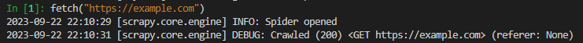
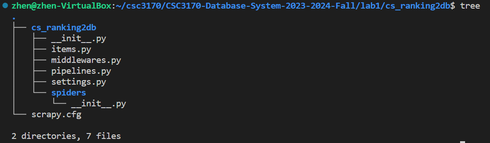
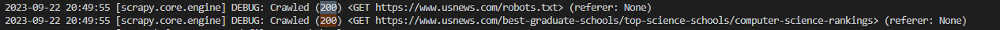
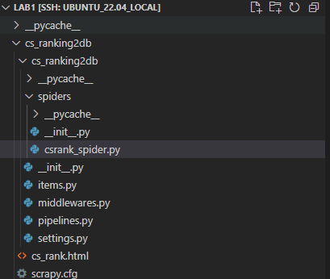
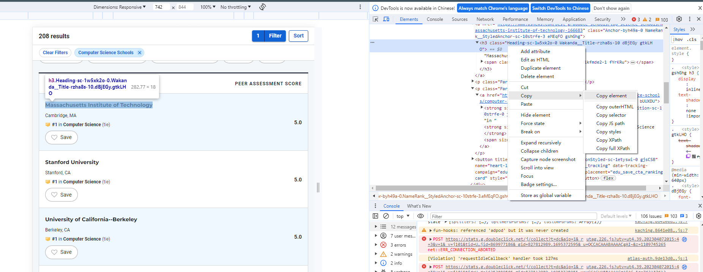
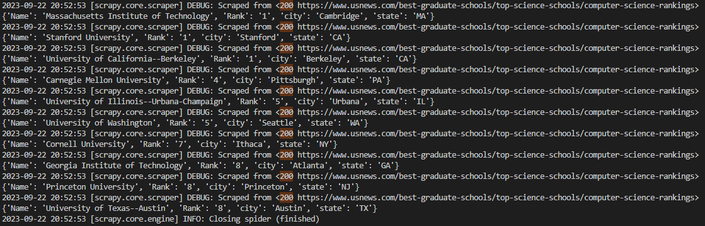
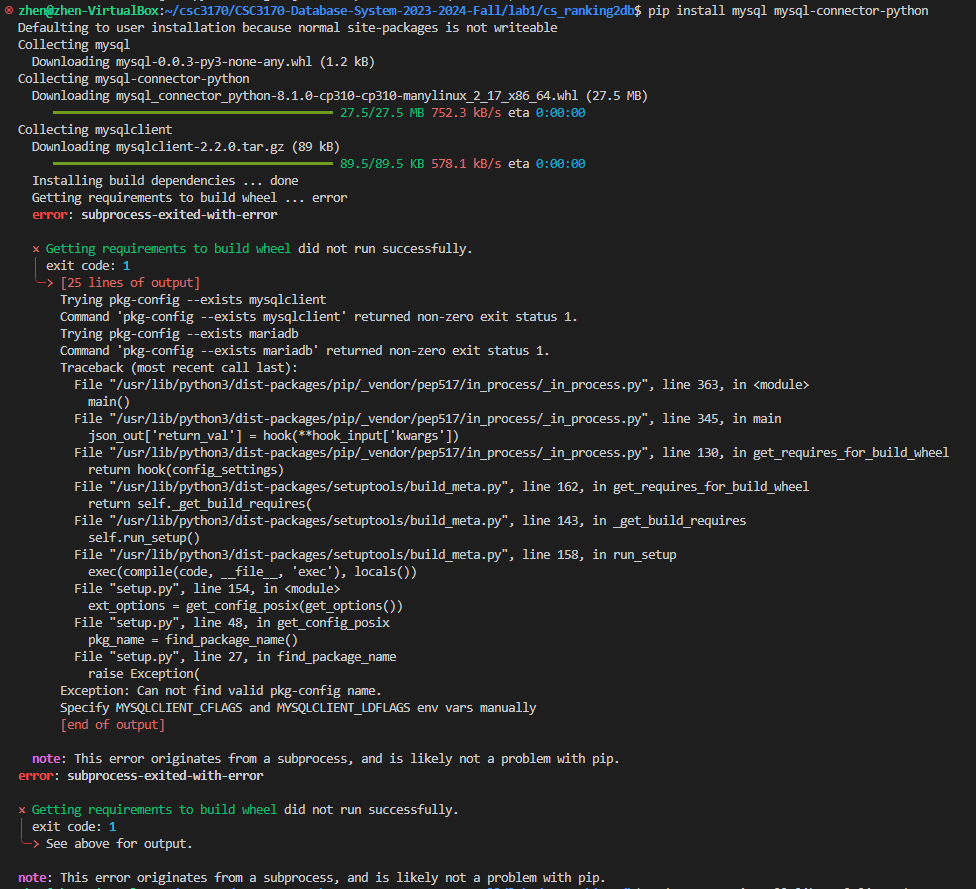
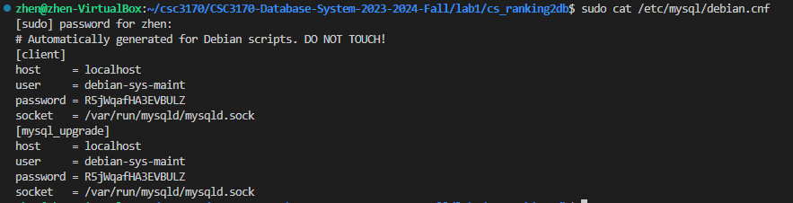
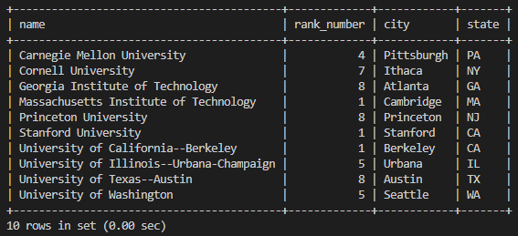

# Lab 1 Crawler and Load Database 

> Author: Zhen TONG 2023-9-22

## Before Start

The first lab focuses on Python web crawling and populating data into your local database. We have designed this lab program with the understanding that this technique will be essential for your final project. Beyond just creating a database, it's crucial to have valuable data to populate it with. In this project, we will leverage Scrapy, a highly efficient web crawling framework, in conjunction with MySQL. Our target website for crawling is the US News computer science ranking page:

[US News Computer Science Rankings](https://www.usnews.com/best-graduate-schools/top-science-schools/computer-science-rankings)

You can access Lab 1 in this [GitHub repository](https://github.com/58191554/CSC3170-Database-System-2023-2024-Fall/tree/main/lab1).

We will guide you through the entire process in a systematic pipeline order:

- **Crawl Data**
  - **Utilizing the Scrapy Shell**
  - **Setting Up the Workspace**
  - **Creating Our First Spider**
  - **Data Extraction**
- **Store Data**
  - **Dependencies**
  - **Meta Data**
  - **Saving Scraped Items to the Database**
  - **Activating Our Item Pipeline**
- **Running and Testing**

Before we begin, we highly recommend using a Linux-based system. Ubuntu 22, in particular, will greatly simplify the process. Now, let's dive into the exciting world of web crawling! 🚀

## Crawl Data

### **Use the scrapy shell**

Let's get a little taste of crawling:

**Interactive Console**: The Scrapy Shell provides an interactive Python console where you can run Python code and Scrapy commands in real-time. It's an environment where you can experiment with and explore web page structures and test XPath or CSS selectors.

**Accessing the Shell**: You can access the Scrapy Shell by running the following command in your terminal:

```bash
scrapy shell
$ scrapy shell
2023-09-20 23:46:15 [scrapy.utils.log] INFO: Scrapy 2.11.0 started (bot: whiskyscraper)
...
2023-09-20 23:46:19 [asyncio] DEBUG: Using selector: SelectSelector
In [1]:
```

This command starts the Scrapy Shell and loads the Scrapy project's settings and configurations.

**Fetching Web Pages**: Inside the Scrapy Shell, you can use Scrapy's built-in methods like `fetch` to retrieve web pages. For example:

```
pythonCopy code
fetch("https://example.com")
```



This fetches the specified URL and allows you to inspect its content interactively.

**XPath and CSS Selectors**: You can experiment with XPath and CSS selectors to extract data from web pages. For instance:

```bash
response.xpath('//h1/text()').get()
```

You can view the HTTP response from the web page, which includes the HTML content, headers, and other information:

```bash
In [3]: response
Out[3]: <200 https://example.com>
```

### **Setting Up Your Workspace**

To begin, execute the following command to create your Scrapy project workspace:

```
bashCopy code
scrapy startproject cs_ranking2db
```

Once executed, you'll observe the directory structure within your workspace.



### 

### **Our first Spider**

In essence, the spider performs two fundamental tasks:

- Initiating an initial request.
- Parsing the retrieved data.

The following is the code for our inaugural Spider. Please save it in a file named `csrank_spider.py` within the `cs_ranking2db/spiders` directory of your project:

```python
def start_requests(self):
    urls = [
        "https://www.usnews.com/best-graduate-schools/top-science-schools/computer-science-rankings",
    ]
    for url in urls:
        yield scrapy.Request(url=url, callback=self.parse)
```

**Saving HTML**: Within the `parse` function, this step serves as the foundation for data extraction. While we'll delve deeper into data extraction later, for now, let's start by simply preserving all the HTML data as a file.

```python
def parse(self, response):
    filename = f"cs_rank.html"
    Path(filename).write_bytes(response.body)
    self.log(f"Saved file {filename}")
```

**Using a Fake User-Agent**: Before we dive into the actual scraping process, it's essential to address anti-crawling measures. Altering the user-agent is a widely employed technique in web scraping to overcome website-imposed anti-crawling restrictions. The user-agent serves as an HTTP header field that identifies the client initiating the request to the web server.

To facilitate this, you'll need to install a library that provides user-agent manipulation capabilities.

```
pip install fake-useragent
```

Therefore, add a fack-agent in your setting.py

```python
import fake_useragent
ua = fake_useragent.UserAgent()
USER_AGENT = ua.random
```

Next, navigate to your workspace directory and initiate the spider!

Ensure that the name of your spider matches the one specified in your class definition. In my case, it is named 'cs_ranks'.

```python
class CSRankSpider(scrapy.Spider):
    name = 'cs_ranks'
```

```
scrapy crawl cs_ranks
```

If you observe state numbers in your terminal displaying '200,' congratulations, you have succeeded in your web scraping endeavor. However, if you encounter the less desirable '403' state, it may be due to a misconfiguration in the user-agent settings.🚩



After completing these steps, you may notice an HTML file in your directory. To further visualize the results, open this HTML file using your web browser locally. Upon doing so, you'll be able to view:



### **Extracting data**

Now, let's proceed with parsing within the `parse` function.

**School Name**: To identify the school name, utilize the selection tool located in the upper-left corner to pinpoint the element within the HTML. From the image, it's evident that the school name is enclosed within an `<h3>` element and consists of two distinct parts. Right-click on this element to access the context menu and…



Subsequently, we can compose the following code to retrieve the school element:

```python
h3_text = element.xpath('.//h3/text()').get()
span_text = element.xpath('.//span/text()').get()
school = h3_text+span_text
print(school)
```

**Rank Number**: Determining the rank number is a bit tricky since the element structure is…

```html
<strong size="2" class="Strong-sc-1m7huwa-0 NameRank__RankPosition-sc-10strfe-0 jDdPar efzpHW">#<!-- -->8<!-- --> </strong>
```

The rank number is embedded within a format `<!-- -->`, which necessitates the use of regular expressions for extraction. Import re first. While there might be more efficient methods, employing regular expressions is a valuable practice that enhances your web scraping toolkit.

```python
rank_element_str = row.xpath('.//strong').get()
match = re.search(r'<!-- -->(\d+)<!-- -->', str(rank_element_str))
if match:
    rank = match.group(1)
else:
    rank =-1
```

**City and State**: The representation of cities and states is as follows:

```html
<p class="Paragraph-sc-1iyax29-0 cTffBs">Austin<!-- -->, <!-- -->TX</p>
```

Therefore, the RE knowledge can be used again:

```python
location_element = row.xpath('.//p').get()
matches = re.findall(r'([\w\s]+)<!-- -->,\s<!-- -->([\w\s]+)', str(location_element))
if matches:
    city, state = matches[0]
else:
    city, state = None, None
```

As long as we extract the element with a school name, we combine all attributes. 

```python
if name_prefix and name_suffix:
    yield {
        'Name': name_prefix + name_suffix,
        'Rank': rank,
        'city': city, 
        'state': state
    }
```

Finally, run the spider again and you will see this:



### Yield

In the `parse` method of a Scrapy spider, using `yield` is a common and important practice. Scrapy is built on asynchronous programming principles, and using `yield` allows you to create generator functions. [More information](https://www.geeksforgeeks.org/use-yield-keyword-instead-return-keyword-python/)


## Store Data

### Dependency

First, you need to install the mysql connection tool library 

```
pip install mysql mysql-connector-python
```

but if you meet some ERROR like:



There is a dependency, and you need to first install libmysqlclient-dev, I am using Ubuntu, and:

``` 
sudo apt-get install libmysqlclient-dev
```

You may not meet this problem with other system, I mention here just in case you need.

### Meta Data

In the `pipelines.py` file, you have the opportunity to define the behavior of your Scrapy code—what actions to take after obtaining the data.

First and foremost, it's crucial to ensure that you have the correct MySQL database information in place. In a Linux environment, you can verify the host, user, and password by running the following commands:

```
sudo cat /etc/mysql/debian.cnf
```



After you know the database information , you can start the pipeline design. First, you need to set up a database for this project

```
mysql -u <YOUR USER NAME> -p
```

```
Welcome to the MySQL monitor.  Commands end with ; or \g.
Your MySQL connection id is 12
Server version: 8.0.34-0ubuntu0.22.04.1 (Ubuntu)

Copyright (c) 2000, 2023, Oracle and/or its affiliates.

Oracle is a registered trademark of Oracle Corporation and/or its
affiliates. Other names may be trademarks of their respective
owners.

Type 'help;' or '\h' for help. Type '\c' to clear the current input statement.

mysql> CREATE DATABASE cs_rank_db;
Query OK, 1 row affected (0.09 sec)

mysql> exit;
Bye
```

Then, design you table. I set the name attribute as PK because the rank is not unique 🤣Carefully set the PK length~

```python
class CsRanking2DbPipeline:

    def __init__(self):

        self.conn = mysql.connector.connect(
            host = 'localhost',
            user = 'debian-sys-maint',
            password = 'R5jWqafHA3EVBULZ',
            database = 'cs_rank_db'
        )

        ## Create cursor, used to execute commands
        self.cur = self.conn.cursor()
        
        ## Create quotes table if none exists
        self.cur.execute("""
        CREATE TABLE IF NOT EXISTS cs_rank(
            name text, 
            rank_number int,
            city text,
            state text, 
            PRIMARY KEY (name(255))  -- Specify a key length (e.g., 255 characters)
        )
        """)

```

### Save Scraped Items Into Database

Moving forward, we will employ the `process_item` event within our Scrapy pipeline to store the scraped data in our MySQL database.

The `process_item` method will be triggered every time an item is scraped by our spider. Therefore, it is essential to configure the `process_item` method to insert the item's data into the database

```python
def process_item(self, item, spider):
    ## Define insert statement
    self.cur.execute(""" insert into cs_rank (name, rank_number, city, state) values (%s,%s,%s,%s)""", (
        item["name"],
        str(item["rank_number"]),
        item["city"], 
        item["state"]
    ))
    ## Execute insert of data into database
    self.conn.commit()
```

We will also the `close_spider` method, which will be called when the Spider is shutting down, to close our connections to the cursor and database to avoid leaving the connection open.

```python
def close_spider(self, spider):
    ## Close cursor & connection to database 
    self.cur.close()
    self.conn.close()
```

### Activate Our Item Pipeline

Finally, to activate our Item Pipeline we need to uncomment this line in our `settings.py` file:

```python
# Configure item pipelines
# See https://docs.scrapy.org/en/latest/topics/item-pipeline.html
ITEM_PIPELINES = {
   "cs_ranking2db.pipelines.CsRanking2DbPipeline": 300,
}
```

## Run and Test

Now, you are allowed to run your first crawl pipeline program

```
scrapy crawl cs_ranks
```

Go into your database and check if everything is going on well:

```sql
USE cs_rank_db;
SELECT * FROM cs_rank;
```



Yeah! Now you can play with it with more sql like:

```sql
SELECT * FROM cs_rank ORDER BY rank_number DESC;
```

Now you must have gained some knowledge about scrapy and database pipeline. Have a nice weekend!